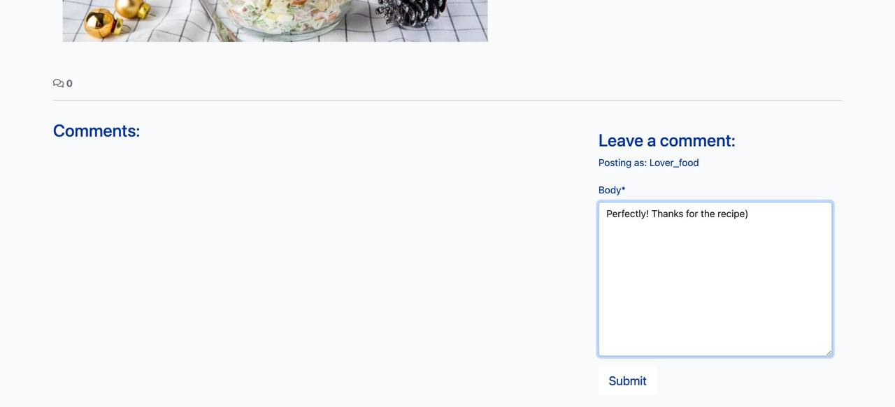
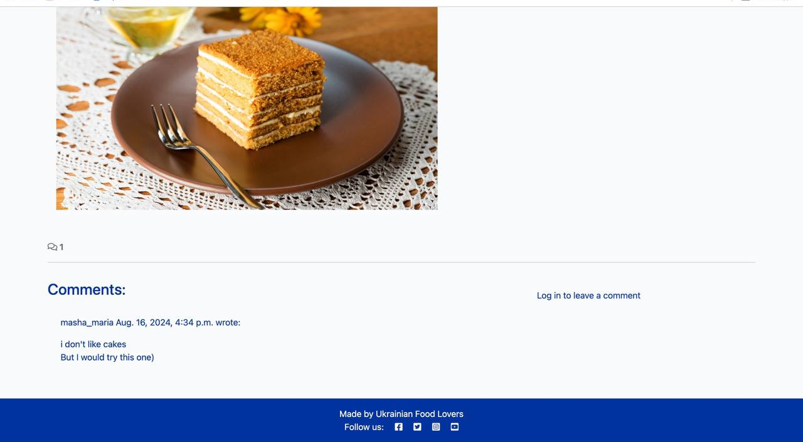
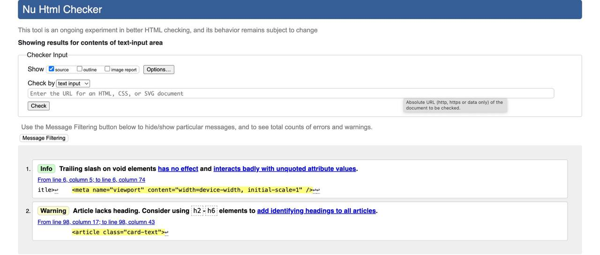

# UkrainianRecipes|Blog

The blog runs in the Code Institute's mock terminal on Heroku.

he blog runs in the Code Institute's mock terminal on Heroku.

The live link can be found here: [UkrainianRecipes|Blog](https://ukrainian-recipesblog-5db2d3bf9e1c.herokuapp.com/).

The admin link can be found here: [UkrainianRecipes|Blog](https://ukrainian-recipesblog-5db2d3bf9e1c.herokuapp.com/admin/login/?next=/admin/)

# Introduction

Our culinary blog is created for everyone who loves to cook and explore new, interesting recipes. Here, you'll find detailed step-by-step recipes of Ukrainian cuisine, celebrating the rich and diverse culinary traditions of Ukraine. It’s a place where you can discover unique recipes, try something new, and discuss your experiences with other cooking enthusiasts.

All visitors can browse recipes, share them with friends, and leave comments on posts. Comments are a great way to discuss recipes, exchange tips, or ask questions. However, all comments must be approved by an administrator before they become visible on the site. This helps maintain a pleasant atmosphere and ensures valuable discussions.

Users also have the opportunity to submit their own Ukrainian recipes or propose collaborations through the "About Us" page. If your recipe is approved by the administrator, it will be published on the site with your name. This way, you can share your culinary masterpieces with others and become part of our cooking community.

Our administrators can log into the control panel to create, edit, and delete posts, as well as manage comments and user submissions.

## Project Goals

### Promote Ukrainian Culinary Traditions:

- Showcase the rich and diverse flavors of Ukrainian cuisine, making traditional recipes accessible to a global audience
- Preserve and share authentic recipes passed down through generations, ensuring the continued appreciation of Ukrainian culinary heritage.

### Foster a Cooking Community:

- Create an engaging platform where cooking enthusiasts can share their experiences, tips, and recipes, building a vibrant community centered around Ukrainian cuisine.
- Encourage user interaction through comments and recipe submissions, allowing for a collaborative and supportive environment.

### Provide High-Quality Content:

- Offer detailed, easy-to-follow recipes with clear instructions and high-quality images, ensuring a positive user experience.
- Maintain the accuracy and authenticity of all content, with a focus on traditional Ukrainian ingredients and cooking methods.
  
### Support User Contributions:

- Enable users to submit their own Ukrainian recipes, fostering a sense of ownership and participation in the community.
- Ensure a streamlined submission and approval process, allowing user-generated content to be featured alongside expert recipes.

### Ensure a Positive User Experience:

- Design an intuitive, user-friendly website that is easy to navigate, with responsive design for seamless use on all devices.
- Moderate comments and user submissions to maintain a positive, respectful atmosphere on the site.

## User Experience (UX)

### User Onboarding:

__Homepage Design:__
- The homepage features a clean and straightforward layout, providing a brief introduction about the blog. Users have options to log in or register on the site.

### Browsing and Navigation:

__Recipe Viewing__
-  Users can access and view individual Ukrainian recipes directly. Each recipe includes a list of ingredients, step-by-step cooking instructions, and a high-quality photograph of the finished dish.
__Responsive Design:__
- The site is fully responsive, ensuring a seamless experience on both desktop and mobile devices.

### Interactions and Engagement:

__Commenting System:__
-  Users can leave comments on recipes to share feedback or ask questions. Comments require administrator approval before being visible.
__Submitting Recipes:__
- Users can submit their own Ukrainian recipes via a dedicated submission page with a simple form.
__Notification System:__
- The site is fully responsive, ensuring a seamless experience on both desktop and mobile devices.

### Content Management:

__Administrator Dashboard:__
-  Admins can manage content, approve comments, and review user-submitted recipes through a streamlined dashboard interface.
__Content Approval Workflow:__
- A structured approval process ensures that only high-quality, authentic content is published.

### Accessibility:

__Accessible Design:__
-  The site includes features for screen readers, high-contrast themes, and keyboard navigation to ensure accessibility for all users.

### Visual and Aesthetic Design:

__Consistent Branding:__
-  The site’s design uses a warm, inviting color palette reflective of Ukrainian culture. Recipes are presented with clear instructions and vibrant images, enhancing the overall user experience.

## User Stories

### First Time Visitor Goals

  - As a first-time visitor, I want to quickly understand what the blog is about and see examples of Ukrainian recipes so that I can decide if this site meets my interests.
  - As a new user, I want to easily browse and view individual recipes to explore the content and see if I want to try any dishes.
  - As a first-time visitor, I want to have the option to register or log in if I decide to interact more with the site, such as leaving comments or submitting recipes.

  ### Authenticated User Goals

  - As an authenticated user, I want to leave comments on recipes to share my feedback, ask questions, or engage in discussions.
  - As a registered user, I want to submit my own Ukrainian recipes so that I can contribute to the blog and share my culinary creations with others.
  - As an authenticated user, I want to receive notifications about the status of my comments and recipe submissions so that I am informed about interactions and updates.

  ### Site Owner Objectives

  - As a site owner, I want to have an efficient content management system to create, edit, and delete posts, ensuring that the blog stays up-to-date and relevant.
  - As a site owner, I want to review and approve user comments and recipe submissions to maintain high quality and authenticity of the content.
  - As a site owner, I want to ensure the site is accessible and performs well across different devices to provide a positive experience for all users.
  - As a site owner, I want to analyze user interactions and feedback to continuously improve the site and engage the community effectively.
  
## Blog Models

### Post Model

| Field            | Type                 | Validation                                      |
|------------------|----------------------|-------------------------------------------------|
| `id`             | AutoField            | Primary Key                                     |
| `title`          | CharField            | `max_length=200`, `unique=True`                 |
| `slug`           | SlugField            | `max_length=200`, `unique=True`                 |
| `author`         | ForeignKey           | `User`, `on_delete=models.CASCADE`, `related_name="blog_posts"` |
| `featured_image` | CloudinaryField      | `'image'`, `default='placeholder'`              |
| `content`        | TextField            |                                                 |
| `created_on`     | DateTimeField        | `auto_now_add=True`                             |
| `ingredients`    | TextField            | `blank=True`                                    |
| `instructions`   | TextField            | `blank=True`                                    |
| `cooking_time`   | PositiveIntegerField | `null=True`, `blank=True`                       |
| `status`         | IntegerField         | `choices=STATUS`, `default=0`                   |
| `excerpt`        | TextField            | `blank=True`                                    |
| `updated_on`     | DateTimeField        | `auto_now=True`                                 |

### Comment Model

| Key         | Field Type      | Validation                                      |
|-------------|-----------------|-------------------------------------------------|
| `id`        | AutoField       | Primary Key                                     |
| `post`      | ForeignKey      | `Post`, `on_delete=models.CASCADE`, `related_name="comments"` |
| `author`    | ForeignKey      | `User`, `on_delete=models.CASCADE`, `related_name="commenter"` |
| `body`      | TextField       |                                                 |
| `approved`  | BooleanField    | `default=False`                                 |
| `created_on`| DateTimeField   | `auto_now_add=True`                             |

### About Model

| Key            | Field Type      | Validation                                      |
|----------------|-----------------|-------------------------------------------------|
| `id`           | AutoField       | Primary Key                                     |
| `title`        | CharField       | `max_length=200`, `unique=True`                 |
| `profile_image`| CloudinaryField | `default='placeholder'`                        |
| `updated_on`   | DateTimeField   | `auto_now=True`                                 |
| `content`      | TextField       |                                                 |

### CollaborateRequest Model

| Key    | Field Type   | Validation               |
|--------|--------------|---------------------------|
| `id`   | AutoField    | Primary Key               |
| `name` | CharField    | `max_length=200`          |
| `email`| EmailField   |                           |
| `message`| TextField  |                           |
| `read` | BooleanField | `default=False`           |

## Visual Design:

### Colors
- Consistent Branding: Utilizes a rich blue (#0033A0) as the primary color, complemented by vibrant gold (#FFD700) and clean white (#FFFFFF). This color scheme is enhanced with culturally inspired design elements that reflect a sophisticated yet inviting aesthetic.

## Features

### Existing Features

- __Homepage Overview:__

  - Introduction: Provides a brief introduction to the blog's focus on Ukrainian cuisine. 
  
  

  - Login/Register: Options for users to log in or register for an account
  
  
  

- __About Page:__

  - Author Information: Provides details about the author of the site, including their background, expertise, and passion for Ukrainian cuisine.
  - Site Objectives: Outlines the goals and purpose of the blog, including its mission to share authentic Ukrainian recipes and build a community of cooking enthusiasts.
  
  

- __Recipe Viewing:__

  - Detailed Recipes: Each recipe includes ingredients, step-by-step instructions, and a high-quality photo of the dish.
  
  

- __Commenting System:__

  - Comment Submission: Authenticated users can leave comments on recipes. Users must be logged in to submit comments.
  
  
  

  - Comment Management: Users can edit or delete their own comments after posting.

  

  - Moderation: All comments are subject to administrator approval before being visible on the site.
  
  

- __Recipe Submission:__
  - Submission Form: Registered users can submit their own Ukrainian recipes using a dedicated submission form.
  - Approval Workflow: Submitted recipes are reviewed and approved by administrators before being published.
  
  

- __Notification System:__

  - Comment Notifications: Users are notified when their comments are approved and published.
  -  Submission Notifications: Users receive updates when their submitted recipes are approved and featured on the site.

  

- __Content Management:__

  - Administrator Dashboard: Admins can create, edit, and delete posts through a user-friendly dashboard.
  - Content Approval: Admins manage and approve user comments and recipe submissions to maintain content quality.

  

  - __Footer Links:__

  - Social Media Links: The footer includes links to the blog's social media profiles, allowing users to connect and engage with the blog on platforms such as Facebook, Instagram, and Twitter.

  

- __Responsive Design:__

  - Mobile and Desktop Compatibility: The site is designed to work seamlessly across both mobile devices and desktop computers.
  

### Features left to implement

- __Like Button: The ability for users to like or upvote recipes is not yet implemented.__
- __Save to Favorites: Users cannot currently add recipes to a personal list of favorites or bookmarked recipes.__
- __Filter Options: There is no functionality to filter recipes by categories such as ingredient type, difficulty, or preparation time.__
- __Keyword Search: The ability to search for recipes using keywords or ingredients is not yet available.__
- __Profile Editing: Users are unable to modify their profile information or update personal details.__
- __Profile Photos: There is no option for users to add or change their profile pictures.__

## Testing

### Homepage Testing
| Tested              | Expected Result                                                             | Actual Result                                                                                   |
|---------------------|-----------------------------------------------------------------------------|------------------------------------------------------------------------------------------------|
| Opened the homepage | The homepage should display a list of blog posts, each with a title, description, ingredients, instructions, and a photo. | The homepage correctly displayed posts with titles, descriptions, ingredients, instructions, and photos. |

### Recipe Post Testing

| Tested                        | Expected Result                                                                                  | Actual Result                                                                      |
|-------------------------------|--------------------------------------------------------------------------------------------------|-------------------------------------------------------------------------------------|
| Viewed individual recipe posts | Each recipe post should display a detailed view including ingredients, step-by-step instructions, and a high-quality photo of the dish. | Recipe posts displayed correctly with ingredients, instructions, and photos as expected. |

### About Page Testing

| Tested                  | Expected Result                                                                                             | Actual Result                                                                         |
|-------------------------|-------------------------------------------------------------------------------------------------------------|--------------------------------------------------------------------------------------|
| Accessed the About page | The About page should provide information about the author and a form for collaboration requests.         | The About page correctly displayed the author’s information and the collaboration request form. |

### User Authentication Testing

| Tested                     | Expected Result                                                                  | Actual Result                                                   |
|----------------------------|----------------------------------------------------------------------------------|----------------------------------------------------------------|
| Registered a new user      | The registration process should successfully create a new user account.          | New user accounts were created successfully.                   |
| Logged in and out          | Registered users should be able to log in and log out of their accounts.         | Login and logout functions worked correctly.                    |
| Password reset functionality | Users should be able to reset their password through the password recovery process. | Password reset process was successfully completed.              |

### Commenting System Testing

| Tested                            | Expected Result                                                                                           | Actual Result                                                                        |
|-----------------------------------|-----------------------------------------------------------------------------------------------------------|-------------------------------------------------------------------------------------|
| Added a comment as a registered user | Registered users should be able to post, edit, and delete their own comments.                            | Comments were successfully added, edited, and deleted by registered users.          |
| Attempted to comment without being logged in | Users must be logged in to leave comments.                                                                 | The system correctly prevented non-logged-in users from posting comments.            |
| Verified comment approval process | Comments should require administrator approval before being visible on the site.                        | All comments were held for administrator approval before appearing on the site.    |
           |

### Profile Management Testing

| Tested               | Expected Result                                          | Actual Result                                             |
|----------------------|----------------------------------------------------------|----------------------------------------------------------|
| Edited user profile  | Users should be able to update their profile information. | Users were able to successfully edit their profile information. |
| Updated profile photo | Users should be able to upload or change their profile photo. | Profile photo updates were completed successfully.      |

### Security and Performance Testing

| Tested                         | Expected Result                                                                                          | Actual Result                                                                          |
|--------------------------------|----------------------------------------------------------------------------------------------------------|---------------------------------------------------------------------------------------|
| Tested for common security issues | The site should be secure against common vulnerabilities such as XSS or SQL injection.                  | The site was secure against common security threats.                                 |
| Assessed site performance      | The site should load quickly and respond promptly to user actions.                                       | The site demonstrated good performance with fast loading times and responsive interactions. |

### Cross-Browser and Cross-Platform Testing

| Tested                                      | Expected Result                                                                                                           | Actual Result                                                                                             |
|---------------------------------------------|---------------------------------------------------------------------------------------------------------------------------|----------------------------------------------------------------------------------------------------------|
| Accessed site on different browsers and devices | The site should function consistently across various browsers (Chrome, Firefox, Safari) and devices (desktop, mobile). | The site performed well across different browsers and devices, maintaining consistency and functionality. |

### Mobile Responsiveness Testing

| Tested                           | Expected Result                                                                                         | Actual Result                                                                       |
|----------------------------------|---------------------------------------------------------------------------------------------------------|--------------------------------------------------------------------------------------|
| Tested site on various mobile devices | The site should be fully responsive, providing an optimal user experience on mobile devices. | The site displayed correctly and functionally across various mobile devices. |

### Accessibility Testing

| Tested                      | Expected Result                                                                                              | Actual Result                                                                                     |
|-----------------------------|--------------------------------------------------------------------------------------------------------------|--------------------------------------------------------------------------------------------------|
| Checked for accessibility features | The site should be accessible to users with disabilities, including screen reader compatibility and keyboard navigation. | The site met accessibility standards, including screen reader compatibility and effective keyboard navigation. |

### Backup and Restore Testing

| Tested                             | Expected Result                                                          | Actual Result                                             |
|------------------------------------|--------------------------------------------------------------------------|----------------------------------------------------------|
| Tested backup and restore functionality | The site’s data should be regularly backed up and restorable without issues. | Backups were successfully created and restored as expected. |

### Internationalization Testing

| Tested                       | Expected Result                                                    | Actual Result                                               |
|------------------------------|--------------------------------------------------------------------|--------------------------------------------------------------|
| Verified multi-language support | The site should display content correctly in multiple languages if supported. | The site displayed content correctly in supported languages. |

###  Validation Testing

__Python Validation Testing__

- [PEP8](https://pep8ci.herokuapp.com/#) 
  

__HTML__

__CSS__

__Accessibility__

### Bugs

#### Solved bugs
  
- E501 line too long (90 > 79 characters)
- E231 missing whitespace after ','
- E302 expected 2 blank lines, found 1
- 
  
### Unfixed Bugs

- No unfixed bugs

## Technologies Used

- [HTML](https://html.com/html5/) used as the mark-up language.
- [CSS](https://en.wikipedia.org/wiki/CSS) for styling.
- [Python](https://www.python.org/) used as the programming language.
- [Django](https://www.djangoproject.com/) framework inlluding some of the below frameworks.
  - [Django Crispy Forms](https://django-crispy-forms.readthedocs.io/en/latest/) for form styling and helpers.
  - [Django allauth](https://django-allauth.readthedocs.io/en/latest/) provided templates for sign in, sign up and sign out.
  - [Crispy Bootstrap 5] template pack for boostrap 5.
  - [Django summernot] for rich text editor for adding posts.
- [ElephantSQL](https://www.elephantsql.com/) database used.
- [Bootstrap 5](https://pypi.org/project/crispy-bootstrap5/) for website styling.
- [Cloudinary](https://cloudinary.com/) to store static files.
- [GIT] for version control.
- [GiHub](https://git-scm.com/) for repository and issues and project board.
- [Codeanywhere](https://app.codeanywhere.com/) fs IDE.
- [Heroku](https://www.heroku.com/) for website deployment.
- [Google Fonts](https://fonts.google.com/) for typogoraphy.
- [Font Awesome](https://fontawesome.com/) for website icons.
- [Balsamiq](https://balsamiq.com/) for mobile wireframes.
- [Excalidraw](https://excalidraw.com/) for desktop wireframes.
- [Lucidchart](https://www.lucidchart.com/) for ERD diagram.
- [Coolors](https://coolors.co/) for colour scheme.
- [Shutterstock](https://www.shutterstock.com/) for 4 category images on index page.

# Deployment

### Deploy with Heroku

1. Go on to [Heroku](https://www.heroku.com/) website and [log in](https://id.heroku.com/login) if you already have an account or [sign up](https://signup.heroku.com/) if you don't. 
2. Click on the "New" button on the top right of the home page and select "Create new App" from the drop-down menu.
3. In the "App name" field enter the name of your app. This name has to be unique. 
    - Heroku displays a green tick if your app name is available.
4. In the "Choose a region" field choose either the United States or Europe based on your location.
5. Click the "Create app" button.
6. Next page, top centre of the screen, select the "Settings" tab. 
7. In the "Config Vars" section, click on the "Reveal config Vars" button.
8. In this section you need to enter your environment variables. Usually stored in the env.py file locally. In my case, I have 10 variables: 
    - SECRET_KEY - Django secret key.
    - AWS_ACCESS_KEY_ID - Amazon AWS access key.
    - AWS_SECRET_ACCESS_KEY - Amazon AWS secret access key.
    - AWS_STORAGE_BUCKET_NAME - Amazon AWS bucket name.
    - DATABASE_USER - Amazon RDS database user.
    - EMAIL_HOST_PASS - Email password.
    - EMAIL_HOST_USER - Email address.
    - DATABASE_HOST - Amazon RDS database host.
    - DATABASE_NAME - Amazon RDS database name.
    - DATABASE_PASS - Amazon RDS database password.
9. Copy and paste these variables into the KEY field and their values into the VALUE field.
10. Go back to the top of the screen and select the "Deploy" tab.
11. In the "Deployment method" section select "GitHub".
    1. In "Connect to GitHub" click on the "Search" button. Find the project repository in the list and click on the "Connect" button.
    2. Scroll to the bottom of that page. Click on the "Deploy Branch" button to deploy.
    3. You should also see an option to enable automatic deployment. If you enable this, every time you push to GitHub, Heroku will automatically deploy the app.
12. You will see build log scrolling at the bottom of the screen after that. When successfully finished building the app, you should see the link to your app.

NB: You will need to add your Heroku app link to the ALLOWED_HOSTS in the settings.py file. You also need to make sure that DEBUG is set to False, requirements.txt and Procfile are up to date and pushed to GitHub.

### Clone project 

- To clone this project.  
    - On my [GitHub](https://github.com/OleksandraMakarets) profile page, top centre of the screen click on "repositories".
    -  Find and click on the "TechieMeme-PP4" repository.
    - In the repository page that opens, click on the 'Code' button.
    - Menu that opens make sure you are in the "local" tab, copy the link in "HTTPS".
    - paste that link into the relevant section in your ide to clone the repository.
        - CodeAnywhere. 
        - - Click on the "New Workspace" and paste that link to the "Repository URL" field.
        - vsCode. 
        - - Select "File" and "New Window". In the middle of the page select "Clone Git Repository...", 
        - - Paste that link into the search box at the top of the screen and hit enter.
        - - Select the local destination for repository files.
        

### Fork repository

- To fork this repository.
    - Open my [GitHub repository](https://github.com/OleksandraMakarets/ukrainian-recipes-blog).
    - Click on the 'Fork' button on the top right of the screen.
    - On the 'Create a new fork' page you are given the option to rename that repository and then click on the green 'Create fork' button at the bottom of the form.

## Credits

### Content

- I used the GPT chat to learn the rules of the game and create categories of words.
- I used the Codestar Blog project as the foundation for my own project and I’m grateful for the excellent example it provided. Indeed, this blog project turned out to be the most challenging one I’ve tackled so far.[Codestar blog Code Institute](https://github.com/Code-Institute-Solutions/blog/tree/main)
- [Dennis Ivy](https://www.youtube.com/channel/UCTZRcDjjkVajGL6wd76UnGg) He has the best Django tutorials on YouTube and the way he explains everything is very easy to understand. I owe a lot to him.

## Author

- [@oleksandramakarets](https://github.com/OleksandraMakarets)